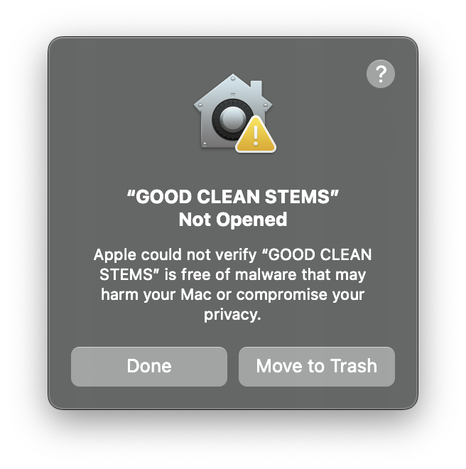
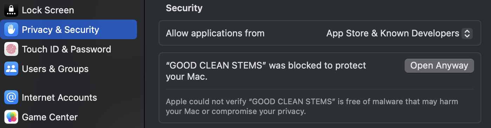

# GOOD CLEAN STEMS

GOOD CLEAN STEMS is a native macOS app for Apple silicon, built for DJs and producers who want focused, high-quality local audio separation and custom Serato stem sidecars.

## Download the tester release

Download the current build from [GitHub Releases](https://github.com/Fotsbeats/GOOD-CLEAN-STEMS/releases/latest).

### Requirements

- Apple silicon Mac
- macOS 14 or newer

The tester build is ad-hoc signed and is not notarized. Follow the first-run steps below if macOS blocks it.

Required separation models download automatically on first use and are cached in `~/Library/Application Support/GOOD CLEAN STEMS/Models`.

## Allow the app on first run

1. Unzip the download and move **GOOD CLEAN STEMS** to your **Applications** folder.
2. Open the app. If macOS displays the warning below, click **Done**. Do not click **Move to Trash**.

3. Open **System Settings → Privacy & Security**.
4. Scroll to the **Security** section and click **Open Anyway** beside the GOOD CLEAN STEMS message.

5. Authenticate if macOS asks, then confirm **Open**. This approval is normally required only once for that app version.

## Testing

This public repository is used to distribute tester builds and model assets. Please report release-specific feedback through the project's designated testing channel.

The application source code is maintained privately.

## License

GOOD CLEAN STEMS 0.6 and later beta releases are proprietary software licensed by Fotsbeats solely for evaluation and testing. Copyright © 2026 Fotsbeats. All rights reserved. See [LICENSE](LICENSE).

Third-party software, fonts, model configurations, model weights, and trademarks remain under their own licenses and terms. See [THIRD_PARTY_NOTICES.md](THIRD_PARTY_NOTICES.md).
